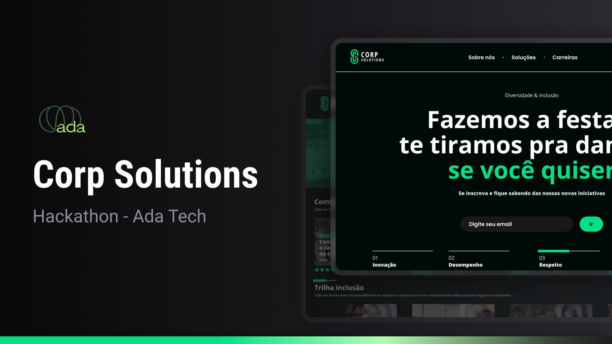

<h1 align="center"> Corp Solutions - Projeto Hackathon </h1>


<p align="center">
  <a href="#-tecnologias">Tecnologias</a>&nbsp;&nbsp;&nbsp;|&nbsp;&nbsp;&nbsp;
  <a href="#-projeto">Projeto</a>&nbsp;&nbsp;&nbsp;|&nbsp;&nbsp;&nbsp;
  <a href="#-layout">Layout</a>&nbsp;&nbsp;&nbsp;|&nbsp;&nbsp;&nbsp;
  <a href="#-grupo">Grupo</a>&nbsp;&nbsp;&nbsp;|&nbsp;&nbsp;&nbsp;
  <a href="#memo-licença">Licença</a>
</p>

<p align="center">
  
</p>

<br>

<p align="center">
  
</p>

## 👾 Repositório criado para atividade do AdaHack  

```
 Clone este repositório
 git clone (https://github.com/ahcarol/corp-solutions-adatech.git)

 Acesse a pasta do projeto no seu terminal/cmd
 cd corp-solution

 Instale as dependências
 npm install

 Execute a aplicação em modo de desenvolvimento
 npm run dev
```

## 🤓 Instruções de login 
<p><b>Usuário:</b> usuario@corpsolution.com
<p></p><b>Password:</b> 12345678

## 🚀 Tecnologias

Esse projeto foi desenvolvido com as seguintes tecnologias:

|  |   |  | 
|----------|----------|----------| 
|   | |  

## 💻 Projeto

O objetivo principal deste Hackathon é criar estratégias e desenvolver soluções inovadoras que ajudem a Corp Solutions a aumentar a diversidade e a inclusão em sua equipe. Os participantes deverão criar soluções que promovam uma cultura organizacional mais diversificada e inclusiva, utilizando tecnologia e criatividade para enfrentar esse desafio. O hackathon visa encontrar ideias e projetos que possam ser implementados dentro de ambientes corporativos para impulsionar a diversidade e a inclusão no ambiente de trabalho, contribuindo para o crescimento dessa causa dentro do mercado de trabalho.

<b>Objetivos do case:</b>
Identificar oportunidades de aumentar a diversidade na Corp Solutions. Desenvolver soluções criativas, aplicáveis e inovadoras para promover a inclusão e equidade no ambiente de trabalho. Contribuir para a construção de uma cultura organizacional diversa, inclusiva e sustentável.

- [Acesse o projeto finalizado, online](https://corp-solutions-three.vercel.app/)


## 🔖 Layout

Você pode visualizar o layout do projeto através [DESSE LINK](https://www.figma.com/design/cKHiq1k1tccqogyfbWZVY1/Apresenta%C3%A7%C3%A3o-CorpSolutions?node-id=1-2&t=wQrvRmvwZ4w2Kdjc-0). É necessário ter conta no [Figma](https://figma.com) para acessá-lo.

  ## 📜 Libs e recursos 

- Vite
- TypeScript
- React
- ReactDOM
- React Router DOM
- React Slick
- Slick Carousel
- Axios
- Zod


## 📈 Organização do Projeto 

<p>O projeto tem uma organização em módulos com a seguiinte arquitetura:</p>
<b> ./src/modules: </b> emos as pastas referentes a cada módulo do sistema e nelas são contidos os custom hooks e components exclussivos,</p>
<p>/src/components:</b>  são armazenados os components universais ou que podem ser compartilhados por diferentes módulos</p>
<p>./src/providers:</b>  São armazenados os providers de contexto da aplicação</p>
<p>./src/services:</b>  São armazenados os serviços de requisição a APIs externas</p>
<p>./src/clients:</b>  Abstrações do consumo de services</p>
  

## 👩🏻‍💻 Grupo 

- [Carolina Dutra](https://github.com/ahcarol);
- [Erick Garcia](https://github.com/erickggarcia);
- [Gabi Padilha](https://github.com/GabiPadilhaf);
- [Luana Portella](https://github.com/portellaluana);
- [Lucas de Grande](https://github.com/lucasdegrande95);
- [Patrick Diniz](https://github.com/PatrickDniz);
- [Renan Neves](https://github.com/renannevesc94);
